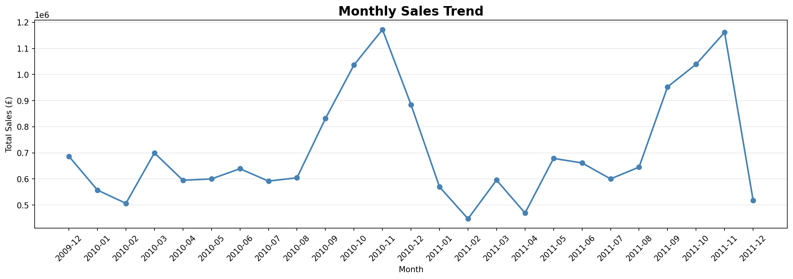
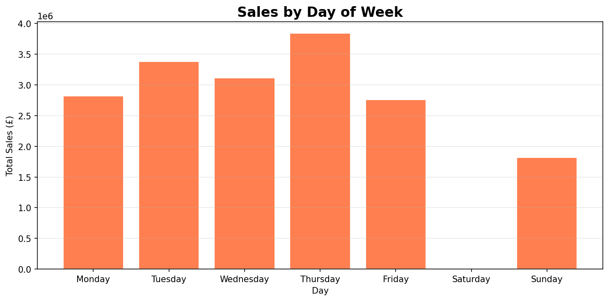
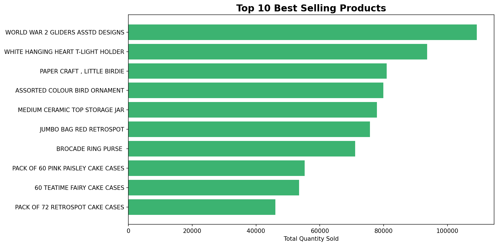
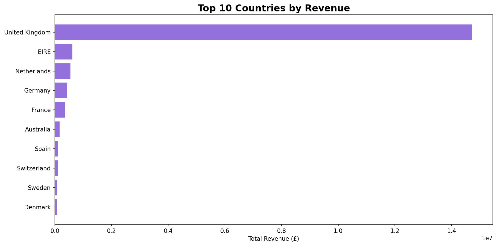
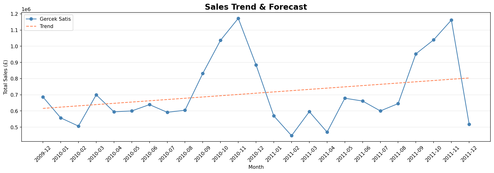

# Sales Trend Analysis & Forecasting

## Project Overview
This project analyzes sales trends and forecasts future revenue using an e-commerce dataset.
The analysis covers monthly trends, day-of-week patterns, top products, and country-based revenue distribution.

## Notebook
[Open in Google Colab](https://colab.research.google.com/drive/1fiDBadHCyetTqAkH2HpJ73bEGxwHQmMD?usp=sharing)

## Dataset
- **Source:** [Online Retail II Dataset - UCI / Kaggle](https://www.kaggle.com/datasets/lakshmi25npathi/online-retail-dataset)
- **Size:** 1,067,371 transactions
- **Period:** December 2009 - December 2011

## Analysis
1. **Monthly Sales Trend** - Revenue over time to identify growth and seasonal patterns
2. **Day of Week Analysis** - Best performing days for sales
3. **Top 10 Products** - Best selling products by quantity
4. **Top 10 Countries** - Highest revenue generating countries
5. **Sales Forecasting** - Linear Regression model to predict future revenue

## Key Findings
- Sales show a strong upward trend towards end of year (seasonality effect)
- Thursday and Wednesday are the highest revenue days
- United Kingdom dominates revenue as the primary market
- Linear Regression forecast suggests continued growth trend

## Visualizations

## Technologies Used
- **Python** - pandas, numpy, matplotlib, seaborn, scikit-learn
- **Google Colab** - Development environment
- **GitHub** - Version control

## Author
hilalinie | Industrial Engineering Student | Data Science Enthusiast
